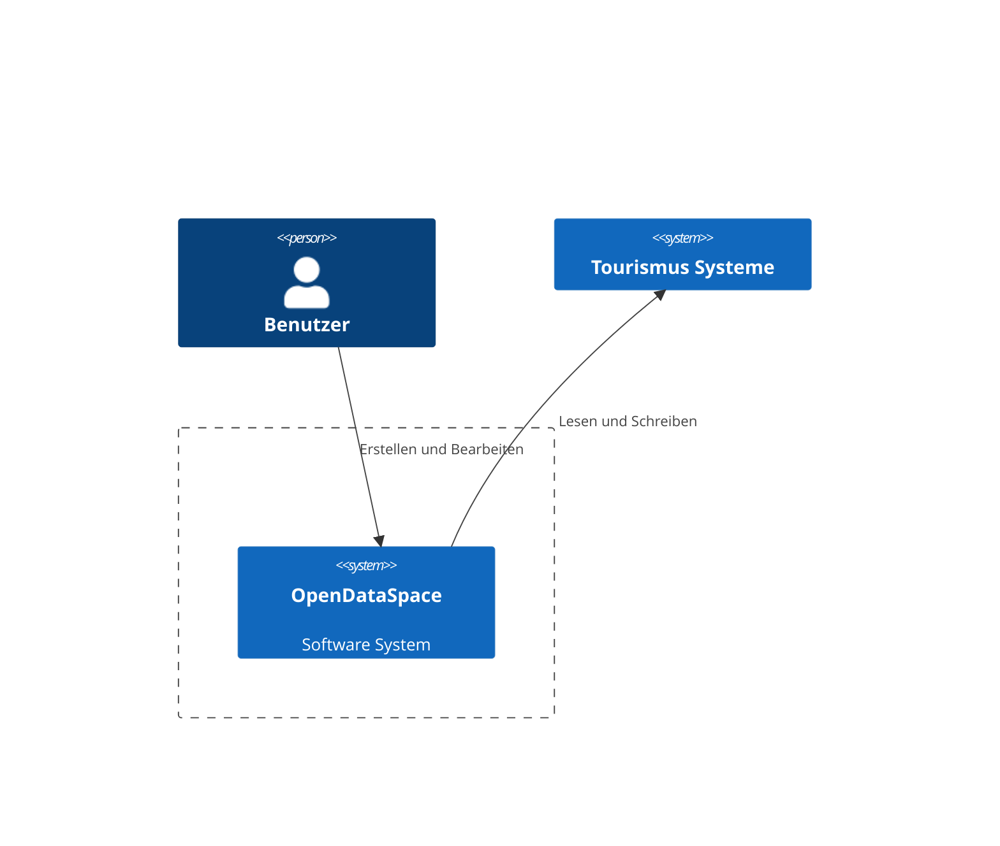

# Kontextabgrenzung

Erster Entwurf System Context

## C4 Model - Context

## Fachlicher Kontext

**\<Diagramm und/oder Tabelle>**

**\<optional: Erläuterung der externen fachlichen Schnittstellen>**

## Technischer Kontext

**\<Diagramm oder Tabelle>**

**\<optional: Erläuterung der externen technischen Schnittstellen>**

**\<Mapping fachliche auf technische Schnittstellen>**
