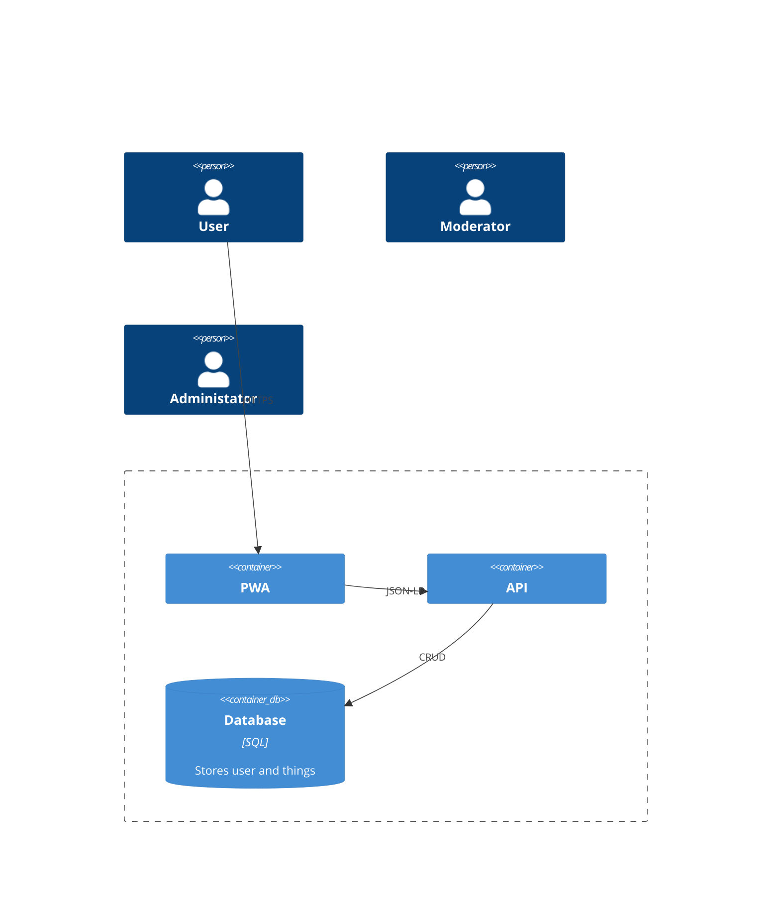

# Bausteinsicht

## Whitebox Gesamtsystem

***\<Übersichtsdiagramm>***

Begründung  
*\<Erläuternder Text>*

Enthaltene Bausteine  
*\<Beschreibung der enthaltenen Bausteine (Blackboxen)>*

Wichtige Schnittstellen  
*\<Beschreibung wichtiger Schnittstellen>*

### \<Name Blackbox 1>

*\<Zweck/Verantwortung>*

*\<Schnittstelle(n)>*

*\<(Optional) Qualitäts-/Leistungsmerkmale>*

*\<(Optional) Ablageort/Datei(en)>*

*\<(Optional) Erfüllte Anforderungen>*

*\<(optional) Offene Punkte/Probleme/Risiken>*

### \<Name Blackbox 2>

*\<Blackbox-Template>*

### \<Name Blackbox n>

*\<Blackbox-Template>*

### \<Name Schnittstelle 1>

…

### \<Name Schnittstelle m>

## Ebene 2

### Whitebox *\<Baustein 1>*

*\<Whitebox-Template>*

### Whitebox *\<Baustein 2>*

*\<Whitebox-Template>*

…

### Whitebox *\<Baustein m>*

*\<Whitebox-Template>*

## Ebene 3

### Whitebox \<\_Baustein x.1\_\>

*\<Whitebox-Template>*

### Whitebox \<\_Baustein x.2\_\>

*\<Whitebox-Template>*

### Whitebox \<\_Baustein y.1\_\>

*\<Whitebox-Template>*
