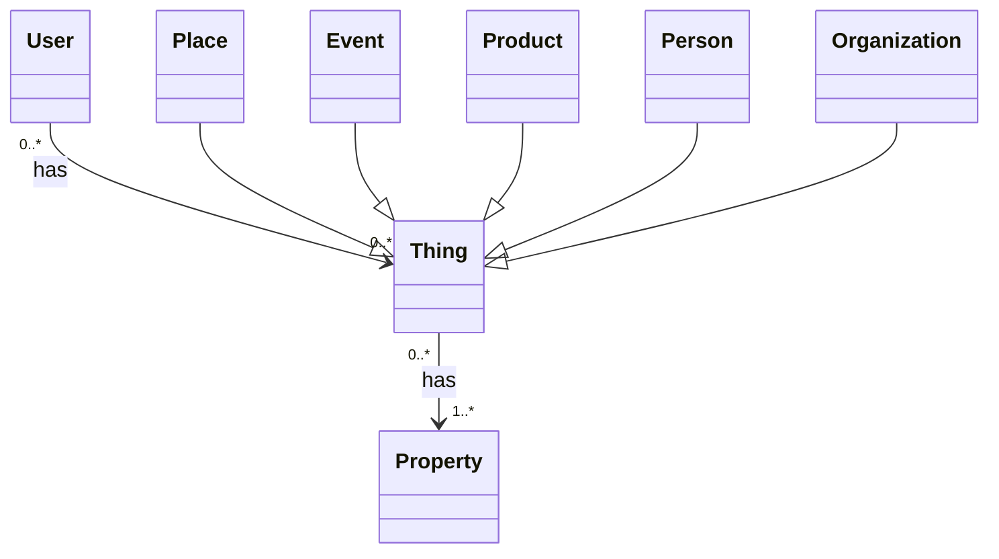

# Querschnittliche Konzepte

## Domain Model

```mermaid
classDiagram
    class User{

    }
    class Thing{

    }
    class Property{

    }

    class Place
    class Event
    class Product
    class Person
    class Organization

    Thing "0..*" --> "1..*" Property : has
    User "0..*" --> "0..*" Thing : has
    Place --|> Thing
    Event --|> Thing
    Product --|> Thing
    Person --|> Thing
    Organization --|> Thing

```

*\<Erklärung>*

## *\<Konzept 2>*

*\<Erklärung>*

…

## *\<Konzept n>*

*\<Erklärung>*
