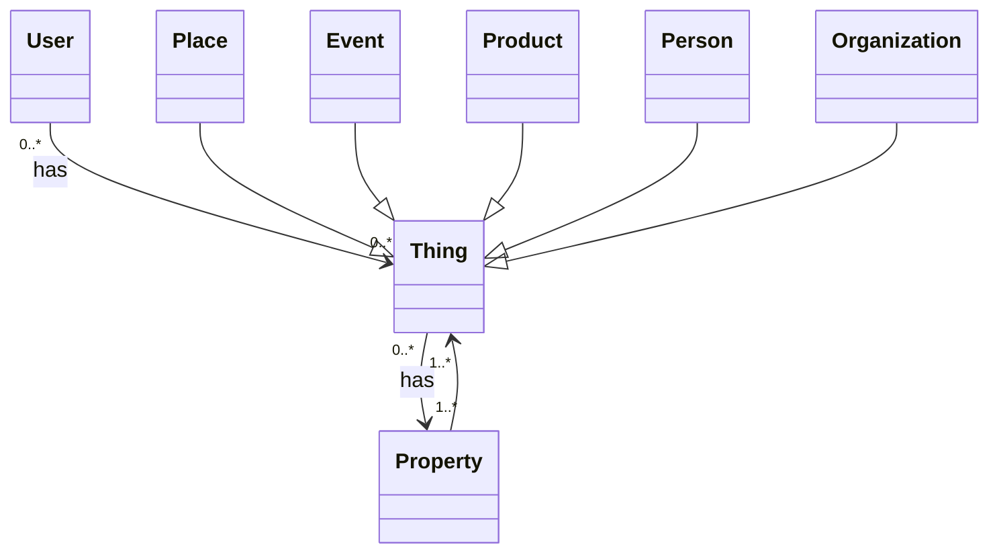

# Querschnittliche Konzepte


## Domain Model


### Examples
```JSONLD
{
    "@context": "https://schema.org/",
    "@type": "Thing",
    "name": "Schema.org Ontology",
    "subjectOf": {
        "@type": "Book",
        "name": "The Complete History of Schema.org"
    }
}
```
[Source](https://schema.org/Thing#examples)

## *\<Konzept 2>*

*\<Erklärung>*

…

## *\<Konzept n>*

*\<Erklärung>*
